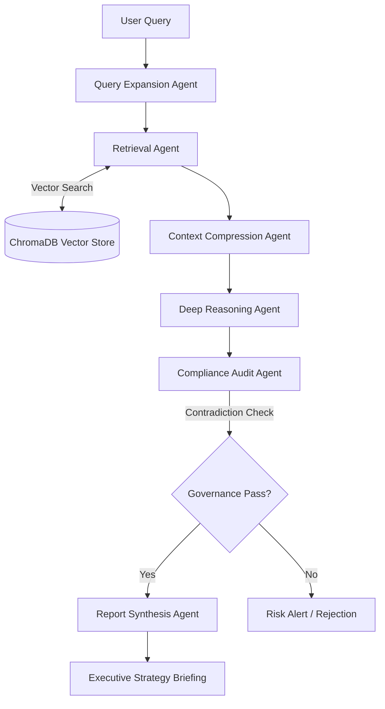

<div align="center">

# 🛡️ INSENTIC AI

**Enterprise Multi-Agent Governance & Intelligence Platform**

[](https://opensource.org/licenses/MIT)
[](https://nextjs.org/)
[](https://fastapi.tiangolo.com/)
[](https://deepmind.google/technologies/gemini/)

*Built with ❤️ by **Team INSIDIOUS 🚀***

A next-generation Enterprise Agentic RAG Platform designed to ingest corporate documents, perform semantic retrieval, and orchestrate a multi-agent workflow for governance validation, compliance analysis, risk assessment, and executive intelligence reporting.

</div>

---

## 🌐 Live Demo

- **Frontend (Firebase Hosting):** [https://agentic-ai-hackathon-insidious.web.app](https://agentic-ai-hackathon-insidious.web.app)
- **Backend (Google Cloud Run):** [https://enterprise-rag-backend-563287512473.us-central1.run.app](https://enterprise-rag-backend-563287512473.us-central1.run.app)

---

## 🎯 Problem Statement

Modern enterprises struggle to quickly extract accurate, compliant, and actionable intelligence from vast repositories of corporate documents, policies, and guidelines. Traditional search systems lack deep semantic understanding, reasoning capabilities, and governance guardrails, leading to hallucinated answers, compliance risks, and inefficient executive decision-making.

There is a critical need for an **Enterprise Agentic RAG Platform** capable of ingesting secure corporate knowledge, performing explainable retrieval, and applying rigorous governance validation to generate boardroom-ready executive intelligence reports.

---

## 💡 Solution Overview

**INSENTIC AI** solves this by orchestrating a deterministic **Multi-Agent RAG System**. Powered by Gemini 1.5 Pro, LangChain, and ChromaDB, the platform dynamically parses enterprise knowledge bases, deploys specialized agents for context compression and deep reasoning, and actively audits outputs against strict compliance policies. The result is a highly reliable, mathematically scored, and explainable executive briefing system built on a secure Enterprise Intelligence Operating System dashboard.

---

## 🏗️ System Architecture

INSENTIC AI is built on a scalable, decoupled architecture:
- **Frontend Layer:** High-performance, highly responsive enterprise dashboard built with Next.js, featuring real-time state management, glassmorphism UI, and interactive telemetry visualization.
- **Backend Layer:** Robust Python FastAPI service handling document ingestion, embedding generation, semantic retrieval, and the multi-agent LLM orchestration.
- **Vector Storage:** ChromaDB for high-dimensional semantic search and chunk retrieval.
- **Intelligence Engine:** Google Gemini 1.5 Pro acting as the core reasoning engine, augmented by LangChain frameworks.
- **Deployment:** Dockerized backend deployed on Google Cloud Run; static frontend deployed on Firebase Hosting.

---

## 🤖 Multi-Agent Workflow

Our architecture employs a sequential multi-agent pipeline to ensure hallucination-free outputs:

1. **Query Expansion Agent:** Analyzes the raw user query and generates semantically expanded search vectors to maximize retrieval accuracy.
2. **Retrieval Agent:** Interfaces with ChromaDB to execute semantic similarity searches and fetch the most relevant knowledge chunks.
3. **Context Compression Agent:** Filters out noise from retrieved chunks, extracting only the factual constraints and relevant context.
4. **Deep Reasoning Agent:** Analyzes the compressed context against the query to formulate a logical reasoning path and initial findings.
5. **Compliance Audit Agent:** Acts as the *Governance Guard*. It strictly audits the reasoning path against corporate policies, checking for contradictions, security risks, and compliance violations.
6. **Report Synthesis Agent:** Compiles the audited findings into a professional, boardroom-ready executive strategy briefing, complete with verifiable citations.

---

## 💻 Technology Stack

| Component | Technology |
| :--- | :--- |
| **Frontend Framework** | Next.js, React, Tailwind CSS, Framer Motion |
| **Backend Framework** | Python, FastAPI |
| **AI / LLM Model** | Google Gemini 1.5 Pro |
| **Orchestration** | LangChain |
| **Vector Database** | ChromaDB |
| **Deployment** | Docker, Google Cloud Run, Firebase Hosting |

---

## ✨ Key Features

- **Enterprise Document Upload & Knowledge Ingestion:** Securely process and index PDF, DOCX, and CSV files.
- **Intelligent Chunking & Embedding Pipeline:** Context-aware document splitting for optimal semantic search.
- **ChromaDB Semantic Retrieval:** High-performance vector-based information retrieval.
- **Governance Validation Layer:** Automated hallucination prevention and contradiction checking.
- **Compliance Audit Engine:** Strict enforcement of internal corporate policies and security standards.
- **Risk Intelligence Dashboard:** Real-time threat anomaly scoring and departmental vulnerability heatmaps.
- **Executive Brief Generation:** Automated synthesis of boardroom-ready strategy reports.
- **RAG Inspector:** Deep observability into source chunk lineage, semantic trace parameters, and match rankings.
- **Explainable Reasoning Path:** Transparent visualization of the LLM's step-by-step decision-making process.
- **Confidence Analysis & Intelligence Radar:** Multi-dimensional scoring (Security, Compliance, Governance, Operations, Risk, Reliability).

---

## 🧩 Platform Modules

The INSENTIC AI platform is organized into the following sidebar workspaces:

- 🎛️ **Command Center:** The primary terminal for initiating queries and generating reports.
- 📁 **Documents:** Manage document ingestion and view raw uploaded files.
- 🗄️ **Knowledge Base:** Explore the vectorized enterprise knowledge spaces.
- 🔍 **RAG Inspector:** Trace semantic retrieval paths and inspect retrieved chunks.
- 🛡️ **Governance Guard:** Review audit attestation seals and contradiction logs.
- ⚠️ **Risk Intelligence:** Monitor global threat metrics and anomaly scores.
- 📄 **Reports:** Access the dynamic archive of generated executive briefings.
- ⚙️ **Settings:** Configure backend endpoints, LLM models, and clear databases.

---

## 🔄 RAG Pipeline Flow



---

## 📁 Project Structure

```text
INSENTIC-AI/
├── backend/                  # FastAPI Application
│   ├── main.py               # Application Entrypoint
│   ├── agents/               # Multi-Agent Logic & Langchain Prompts
│   ├── retrieval/            # ChromaDB & Embedding Utilities
│   ├── ingestion/            # Document Parsing & Chunking
│   ├── requirements.txt      # Python Dependencies
│   └── Dockerfile            # Container Configuration
└── frontend/                 # Next.js Application
    ├── app/                  # App Router Pages
    ├── components/           # React UI Components
    │   ├── dashboard/        # Dashboard Workspaces (Command Center, etc.)
    │   └── ui/               # Reusable UI Elements
    ├── public/               # Static Assets
    ├── tailwind.config.ts    # Styling Configuration
    └── package.json          # Node Dependencies
```

---

## 🚀 Local Setup Instructions

### Backend Setup (FastAPI)

1. Navigate to the backend directory:
   ```bash
   cd backend
   ```
2. Create and activate a virtual environment:
   ```bash
   python -m venv venv
   source venv/bin/activate  # On Windows: venv\Scripts\activate
   ```
3. Install dependencies:
   ```bash
   pip install -r requirements.txt
   ```
4. Set up environment variables (see below).
5. Start the FastAPI server:
   ```bash
   uvicorn main:app --reload --port 8000
   ```

### Frontend Setup (Next.js)

1. Navigate to the frontend directory:
   ```bash
   cd frontend
   ```
2. Install dependencies:
   ```bash
   npm install
   ```
3. Set up environment variables (see below).
4. Start the development server:
   ```bash
   npm run dev
   ```

---

## 🔐 Environment Variables

Create `.env` files in both backend and frontend directories based on these templates. **Never commit actual API keys to version control.**

**Backend (`backend/.env`)**
```env
GEMINI_API_KEY="YOUR_GEMINI_API_KEY"
CHROMA_DB_PATH="./chroma_db"
ENVIRONMENT="development"
```

**Frontend (`frontend/.env.local`)**
```env
NEXT_PUBLIC_BACKEND_URL="http://localhost:8000"
```

---

## ☁️ Deployment Architecture

- **Backend Containerization:** The FastAPI application is containerized using Docker and pushed to Google Container Registry (GCR) or Artifact Registry.
- **Backend Hosting:** Deployed on **Google Cloud Run** for serverless, autoscaling execution.
- **Frontend Hosting:** The Next.js application is statically exported and deployed securely via **Firebase Hosting**.

---

## 📸 Screenshots

*(Replace placeholder links with actual image paths before final submission)*

| Command Center | Risk Intelligence |
| :---: | :---: |
|  |  |

| RAG Inspector | Generated Briefing |
| :---: | :---: |
|  |  |

---

## 🛣️ Future Roadmap

- [ ] Integration with advanced enterprise SSO (Okta, Azure AD).
- [ ] Support for OCR-based ingestion of scanned images and handwritten notes.
- [ ] Export briefings directly to branded PDF and DOCX formats.
- [ ] Real-time integration with external APIs (e.g., Jira, ServiceNow) for automated risk ticketing.
- [ ] Expanded LLM support (Anthropic Claude, local Llama 3 models).

---

## 👨‍💻 Team

Developed for the Agentic AI Hackathon by **Team INSIDIOUS 🚀**

- **Harshit Sharma**
- **Dhruv**
- **Arjun Katiyar**

---

## 📄 License

This project is licensed under the MIT License - see the [LICENSE](LICENSE) file for details.
